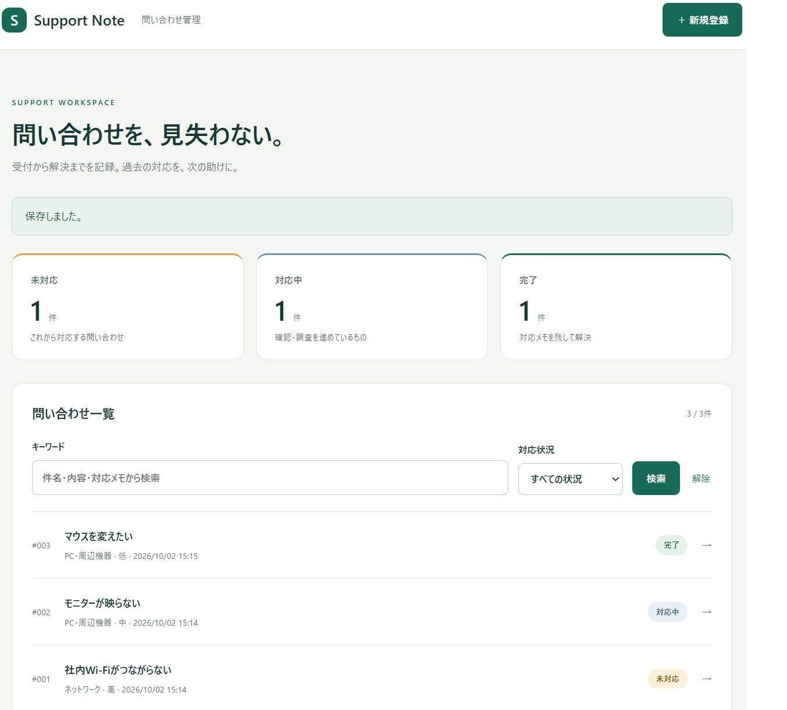
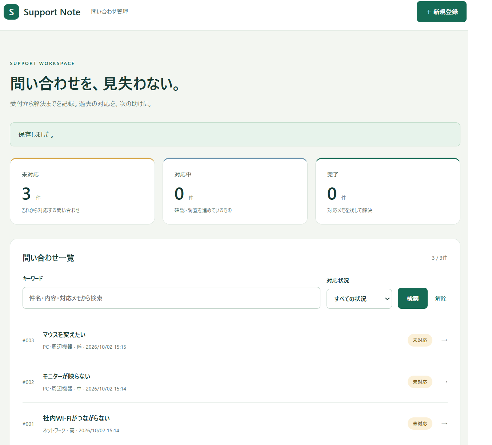

# Support Note — 問い合わせ管理アプリ

社内問い合わせを記録し、優先度・対応状況・過去の対応方法を確認できるJavaの学習用アプリです。

運用保守・社内ヘルプデスクの経験をもとに、問い合わせ対応に役立つ題材を選びました。



## できること

- 件名・分類・内容を入力して問い合わせを登録
- 優先度を「低・中・高」から選択し、一覧に表示
- 未対応・対応中・完了の3段階で対応状況を管理
- 対応メモを残し、件名・内容・メモからキーワード検索
- 対応状況で一覧を絞り込み
- ファイル保存と、再起動後のデータ復元
- 入力エラー時も、入力内容と選択した優先度を保持
- 完了に変更するときは、対応メモを必須にする

## 使用技術

| 技術 | 役割 | 選んだ理由 |
|---|---|---|
| Java 17以降 | アプリの処理 | Javaのクラス・条件分岐・繰り返し・例外・Listを学ぶ |
| JDK標準のHttpServer | ブラウザからのリクエスト受付 | 画面とJavaの処理のつながりを学ぶ |
| HTML / CSS | 画面表示 | フォームによる登録・更新を実装する |
| Properties形式のファイル | データ保存 | 外部ライブラリなしで日本語や改行を保存する |
| Javaによる自動テスト | 動作確認 | 入力チェックや保存・復元を確認する |
| GitHub Actions | 自動テストの実行 | GitHubへの更新時にテストする設定 |

## 新規登録画面



## 起動方法

JDK 17以降が必要です。JDKは、Javaをコンパイル・実行するための開発ツールです。

次のコマンドで確認できます。

```text
java -version
javac -version
```

このリポジトリをダウンロード・展開し、README.mdがあるフォルダでターミナルを開きます。
以下のコマンドは1行ずつ実行してください。

### Windows：PowerShell

```powershell
javac -encoding UTF-8 --release 17 -d out src\supportnote\*.java
java -cp out supportnote.App --demo
```

### macOS / Linux

```bash
bash run.sh --demo
```

ブラウザで http://127.0.0.1:8080 を開きます。

- `--demo` は、保存データが空の場合に架空のサンプル3件を登録します。
- Windowsの通常起動は `java -cp out supportnote.App` です。
- macOS / Linuxの通常起動は `bash run.sh` です。
- 停止するには、起動したターミナルで Ctrl＋C を押します。

### ポート8080が使用中の場合

WindowsのPowerShellでは、コンパイル後に次で起動します。

```powershell
java "-Dsupport.port=8081" -cp out supportnote.App
```

ブラウザで http://127.0.0.1:8081 を開いてください。

## 保存について

- 保存先は `data/tickets.properties` です。
- 保存が成功した後に、メモリ上の一覧を更新します。
- 一時ファイルへの書き込み完了後に、保存ファイルを置き換えます。
- 一括置換に非対応の環境では、通常の置換を使用します。
- 保存ファイルが壊れている場合は、上書きせず起動を止めます。
- バックアップ時は、アプリを停止して `data` フォルダをコピーします。
- 同じ保存ファイルを複数のアプリで同時に使用する構成には対応していません。
- 問い合わせの削除機能は未実装です。

## 自動テスト

WindowsのPowerShellでは、プロジェクトのフォルダで次を実行します。

```powershell
.\test.bat
```

macOS / Linuxでは次を実行します。

```bash
bash test.sh
```

成功すると `PASS: 32 checks` と表示されます。
テストは一時フォルダを使用し、実際の問い合わせデータを変更しません。

既存の25項目に加え、優先度について次の7項目を確認しています。

- 優先度の指定がない場合は「中」になる
- 「高」で登録できる
- 「低」で登録できる
- 不正な優先度を拒否する
- 対応状況を変更しても優先度が変わらない
- 保存ファイルから「高」を復元できる
- 保存ファイルから「低」を復元できる

## 制作方法と自分で変更した部分

初期版のコードと資料はAI支援で作成しました。
その後、AIの説明やコード例を参考に、自分でコードを編集して優先度機能を追加しました。

変更した内容は次のとおりです。

- enumで優先度の選択肢を固定
- 画面から登録処理へ、選択した優先度を渡す
- 優先度の一覧表示・ファイル保存・復元
- 入力エラー時の優先度の選択保持
- 優先度の自動テスト7項目の追加

作業中の問題と変更内容は、[変更記録](docs/MY_CHANGES.md)にまとめています。

## 利用範囲と今後の課題

このアプリは、自分のPCで動かす個人用・学習用のアプリです。
GitHubにはコードと画面画像を公開しています。

フレームワーク、データベース、ログイン機能は使用していません。
共同利用に必要な認証・権限管理・変更履歴・競合制御は未実装です。

今後は、優先度による並び替えや絞り込み、データベースへの保存を学習したいと考えています。

## 参照した公式資料

- [Java 17 HttpServer](https://docs.oracle.com/en/java/javase/17/docs/api/jdk.httpserver/com/sun/net/httpserver/HttpServer.html)
- [Properties](https://docs.oracle.com/en/java/javase/17/docs/api/java.base/java/util/Properties.html)
- [Files](https://docs.oracle.com/en/java/javase/17/docs/api/java.base/java/nio/file/Files.html)